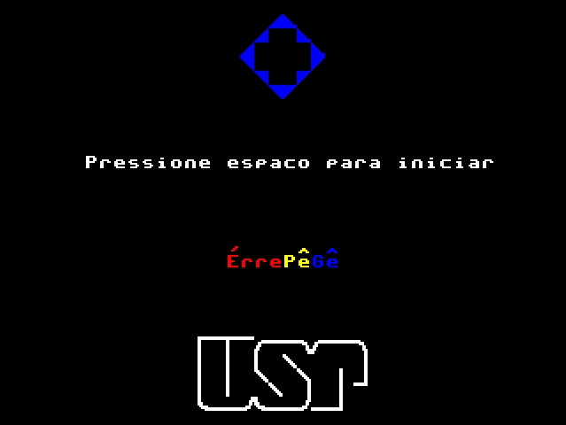
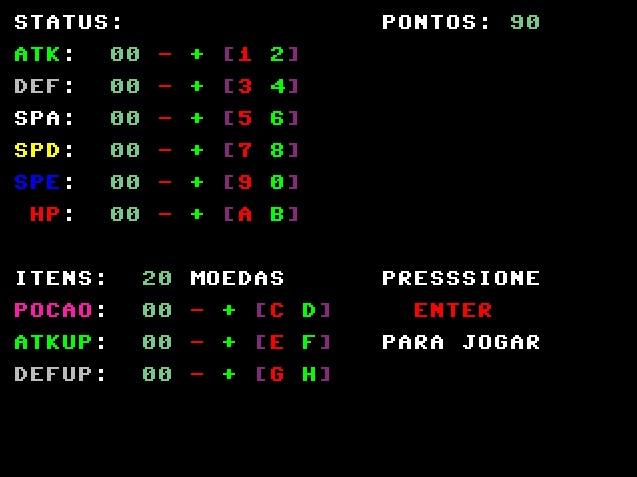
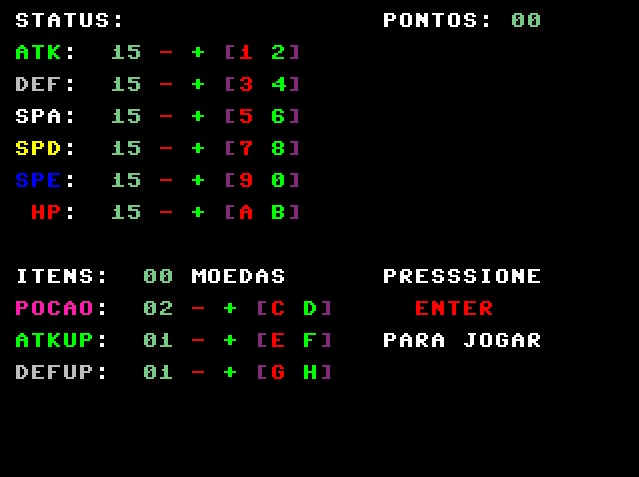
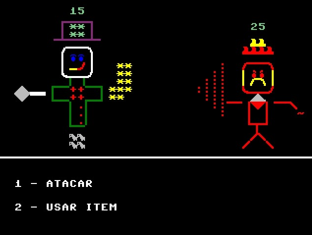
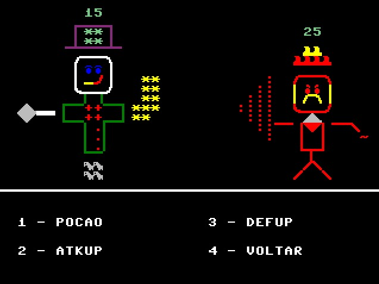
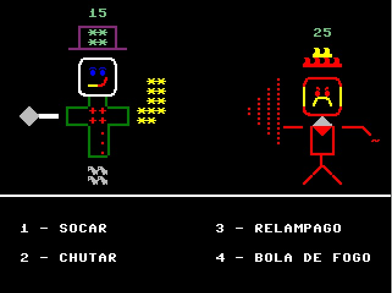
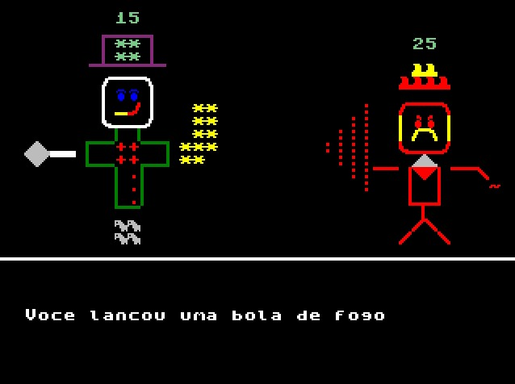
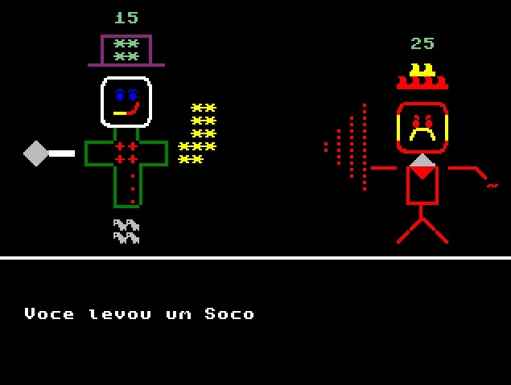
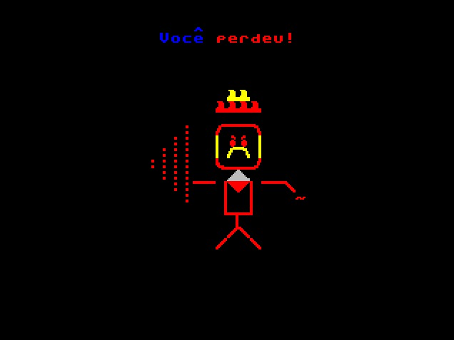

# Trabalho-Prática-Org-Comp
## Modificações na CPU
  Nossa CPU implementa uma instrução extra chamada Jump Indexed. Essa instrução é basicamente equivalente a instrução Jump, mas recebe um valor indexado por um registrador ao invés de um valor imediato, ou seja, nessa instrução PC = MEM(RX). Atualmente, essa instrução é utilizada no nosso jogo para implementar uma estrutura de switch/case com uma Jump Table.

## Modificações no Montador
  A unica modificação que realizamos até o momento no montador foi a adição da nossa instrução de Jump Indexado

## Modificações no Simulador
  A única modificação que realizamos no simulador (browser) até o momento foi a simulação da nossa instrução de jmp indexado juntamente da visualização dela no arquivo view.js (O que inclui a modificação da visualização da próxima instrução). 

## El ÉrrePêGê
  O jogo El ÉrrePêGê pretende ser um simulador de batalhas de um rpg por turnos simples. A seguir, temos as imagens de cada uma das telas do jogo e o vídeo demonstrando o jogo funcionando. Segue também um tutorial básico explicativo do jogo.

### Telas

### Vídeo do Jogo Funcionando
[Link para o YouTube](https://www.youtube.com/watch?v=ndglzhwaIls)

### Como o jogo funciona?
  - Tela Inicial: Apenas para geração do RNG. Enquanto o jogador não pressiona espaço, um registrador é incrementado. Quando espaço for pressionado, o valor desse registrador é salvo em uma posição específica da memória e terá seu valor usado posteriormente
  - Tela de Criação do Personagem: Na criação do personagem, o jogador poderá selecionar os status do seu personagem, além de usar moedas para comprar itens. Os status são: Ataque, Defesa, Ataque Especial, Defesa Especial, Velocidade e HP. Os itens são: Poção, Ataque UP (aumenta ataque), Defesa Up (aumenta defesa). Note que o jogador tem 90 pontos e 20 moedas. Para sair dessa tela, o jogador deve pressionar ENTER.
  - Tela de Batalha 1: Nessa Tela, o jogador tem a opção de Atacar, (que levará para a Tela de Batalha 2) e a opção de Usar Item (que levará para a Tela de Batalha 3).
  - Tela de Batalha 2: Nessa Tela, o jogador tem 4 opções:
    - Socar  (Ataque que causa ATK - DEF_INIMIGO de dano)
    - Chutar (Ataque que causa (2 * ATK - DEF_INIMIGO) / 3 de dano)
    - Relâmpago (Atauqe que causa SPA - SPD_INIMIGO de dano)
    - Bola de Fogo (Ataque que causa (2 * SPA - SPD_INIMIGO) / 3 de dano)
    Após a escolha, o ataque é realizado e o jogador é levado de volta para a Tela de Batalha 1 (se a batalha continua) ou para as telas de vitória e derrota (se a batalha acabou).
  - Tela de Batalha 3: Nessa Tela, o jogador tem 4 opções:
    - Poção (Se tiver alguma, ganha 5 de HP)
    - ATKUP (Se tiver algum, ganha 5 de Ataque)
    - DEFUP (Se tiver algum, ganha 5 de Defesa)
    - Voltar (Volta para a Tela de Batalha 1)

## Créditos e Agradecimentos
Membros da Equipe:
- Antonio Italo Lima Lopes - N-USP 12542290
- Antonio Lucas Sales Cavalcante Barbosa - N-USP 12677529
- Marcos Patrício Nogueira Filho - N-USP 11819063

Nós agradecemos especialmente ao professor Simões por nos dar a oportunidade de entender melhor na prática como criar um processador e como desenvolver softwares (no caso, jogos) usando assembly. Além disso, queríamos agradecer também aos criadores do projeto [Create Screens In Assembly With Python](https://github.com/GustavoSelhorstMarconi/Create-Screens-in-Assembly-with-python), que foi essencial na criação das telas do nosso jogo.
